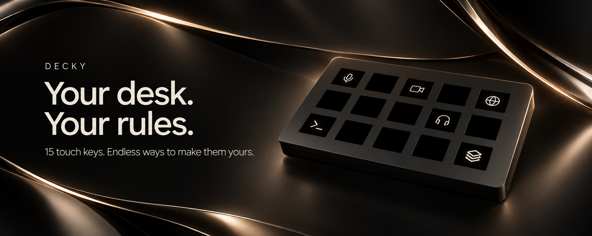
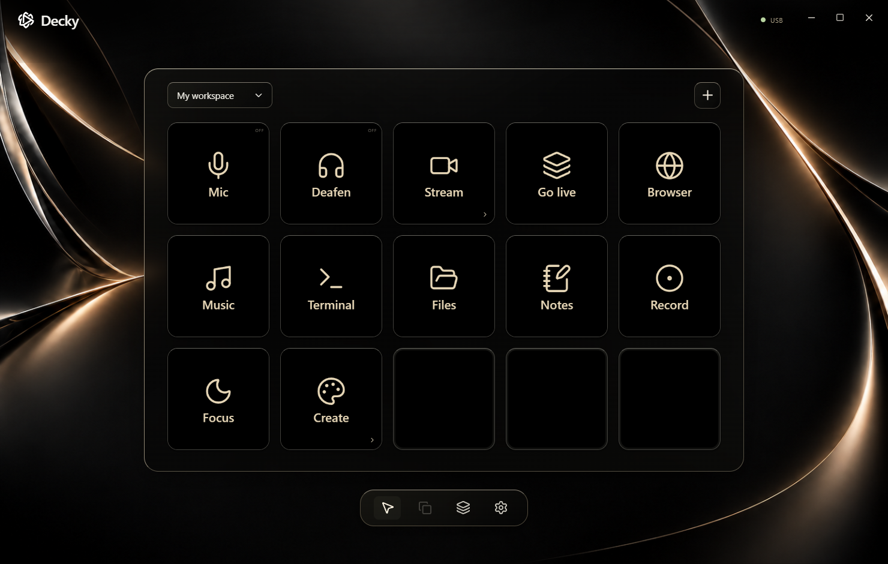
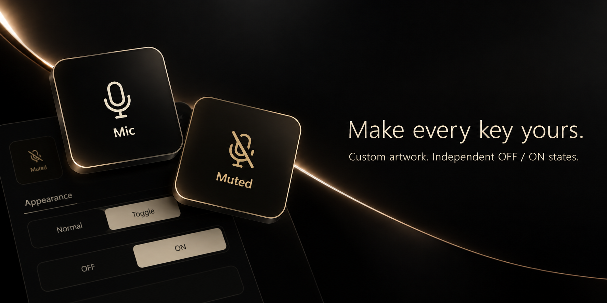
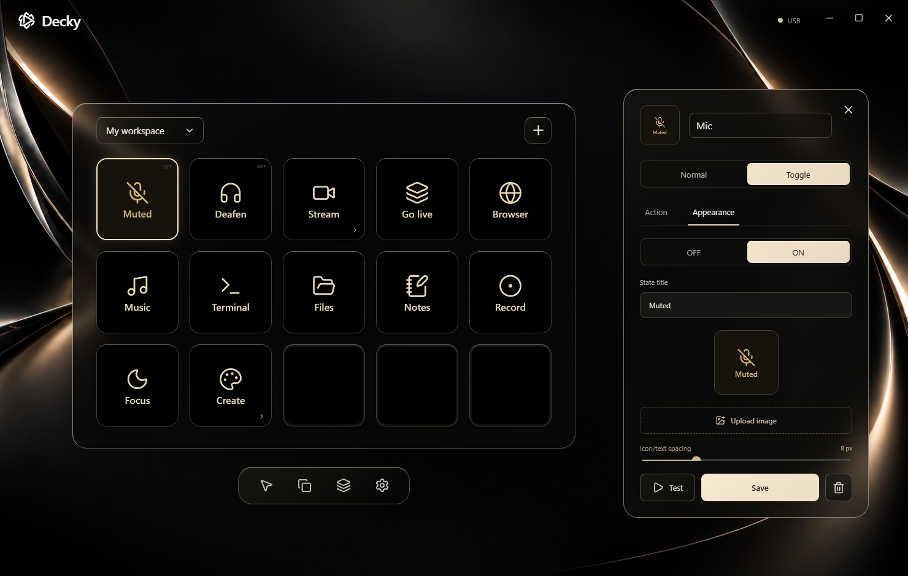
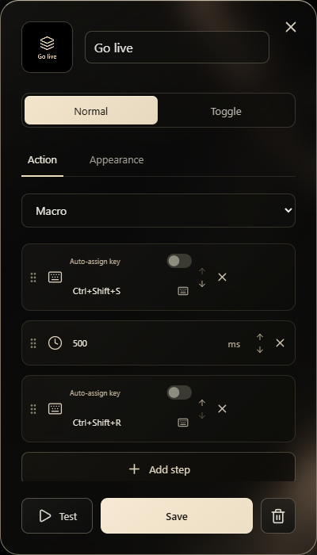
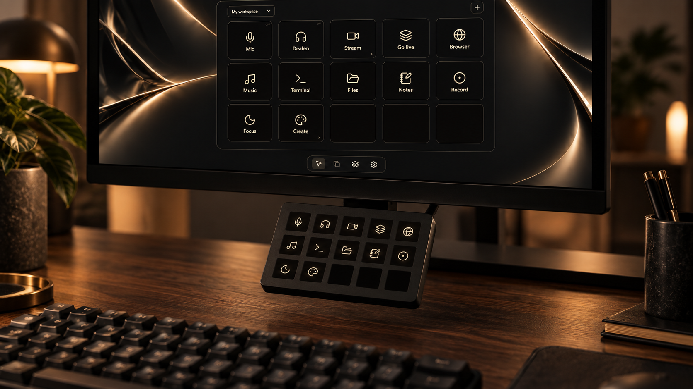

<p align="center">
  <strong>A personal touch control surface for the things you do every day.</strong><br>
  Built around a 7-inch display, a Windows app, and an enclosure you can print yourself.
</p>

<p align="center">
  <a href="#meet-your-new-workspace">Explore Decky</a> ·
  <a href="#make-it-your-own">Customize it</a> ·
  <a href="#build-your-decky">Get started</a> ·
  <a href="DeckSrc/desktop/README.md">Desktop guide</a>
</p>

https://github.com/user-attachments/assets/bed2e491-3eae-4fae-b585-68fe51a1e4fc


## Meet your new workspace

Mute a call. Open your tools. Start the sequence that gets you live.

Decky puts your shortcuts, programs, scripts, and routines on a **5 × 3 touch
grid**. Give each key a purpose, build pages for different parts of your day,
and keep the controls you reach for right in front of you.

The desktop app pairs a floating grid with a contextual editor. Select a key and
the workspace slides aside; close the editor and the deck takes center stage
again.



<p align="center"><sub>Actual Windows app · Example configuration · New workspaces start empty</sub></p>

### Small keys. Useful things.

| Shortcuts & hotkeys                                                                          | Programs & websites                                                                   | Macros & scripts                                                                      |
| :------------------------------------------------------------------------------------------- | :------------------------------------------------------------------------------------ | :------------------------------------------------------------------------------------ |
| Bind your existing apps, record a combination, or let Decky reserve a free shortcut for you. | Find installed programs with their real icons. Put a favorite website one touch away. | Chain actions and delays into a routine, or launch a PowerShell script independently. |
| **Pages & folders**                                                                          | **Normal & toggle keys**                                                              | **Your own artwork**                                                                  |
| Keep streaming, work, and creative tools on separate pages, with a dedicated way back.       | Run an action once, or give its OFF and ON appearances their own visual identity.     | Search the Lucide icon library or bring your own PNG, JPEG, and WebP images.          |

## Make it your own



Choose the icon, label, accent, and background. Fine-tune image zoom, position,
rotation, and brightness. Leave the label out for a centered icon, or adjust the
space between the icon and its title.

**The editor and deck preview update together**, so you can see the result
before saving. Drag keys to move them, drop onto an occupied spot to swap, or
duplicate a key to build out a page. Unassigned keys stay pitch black.

<details>
<summary><strong>Look inside the real appearance editor</strong></summary>



OFF and ON artwork are designed independently. Toggle state changes after a
successful action; it tracks the Decky session rather than reading another app's
state automatically.

</details>

<details>
<summary><strong>Build a routine with the macro editor</strong></summary>

<p align="center"></p>

Combine hotkeys, programs, websites, scripts, and delays into an ordered
sequence. Reorder steps with the editor controls. Independent scripts can keep
running while you use other keys.

</details>

## Give it a place at your desk



Decky's 3D-printed enclosure is designed to hang beneath a monitor, keeping its
touch surface within reach. The repository includes the enclosure and clamp
assets alongside the software and firmware.

Pair a restrained ivory icon set with the obsidian-and-gold app, or fill your
keys with your own images. The same surface can become a streaming panel, a work
launcher, or a set of tools for the project you're in.

## Connected when you need it. Ready when you return.

### Plug in. Pair once.

Start over USB. In Settings, scan for a **2.4 GHz Wi-Fi network**, choose it,
and connect. Decky uses USB when available and falls back to paired, encrypted
Wi-Fi on your local network. USB still supplies power, and the Windows app keeps
your actions running from the system tray.

### Keep your artwork on the deck.

Add a microSD card and Decky saves your page artwork and toggle appearances
locally. After a restart, unchanged images load from the card into memory
instead of being uploaded again. Changing a toggle selects its preloaded
appearance and redraws the affected key.

### Make the next setup easier.

Export your profile to keep a copy of your configuration or move it to another
setup. Firmware installation and updates are available from the desktop app over
USB. The [desktop guide](DeckSrc/desktop/README.md) covers pairing, profiles,
and firmware setup in detail.

## Build your Decky

Decky is a **DIY hardware and software project**. Start with:

| Part       | What you need                                                 |
| :--------- | :------------------------------------------------------------ |
| Display    | Elecrow CrowPanel **Basic 7-inch**, ESP32-S3 with GT911 touch |
| Computer   | A Windows PC running the Decky desktop app                    |
| Connection | A USB data cable; a shared local network for optional Wi-Fi   |
| Storage    | A microSD card for artwork that survives power cycles         |
| Enclosure  | The project's 3D-printable enclosure and monitor-mount parts  |

To run the desktop app from the repository, install Node.js 22.16 or newer and
pnpm, then run:

```powershell
cd DeckSrc/desktop
pnpm install --frozen-lockfile
pnpm dev
```

Use the [desktop and firmware guide](DeckSrc/desktop/README.md#firmware) to
prepare the panel. The firmware uses a pinned PlatformIO toolchain; the
repository's [hardware notes](DeckSrc/notes/memory/MEMORY.md) document the
board, touch input, SD card, and display setup.

## Under the surface

| Explore                                                  | Inside                                                                           |
| :------------------------------------------------------- | :------------------------------------------------------------------------------- |
| [Windows desktop](DeckSrc/desktop)                       | Electron, React, TypeScript, key editing, actions, and device connections        |
| [Device firmware](DeckSrc/firmware)                      | ESP32-S3 firmware, touch handling, rendering, wireless transport, and SD caching |
| [Hardware & build notes](DeckSrc/notes/memory/MEMORY.md) | The decisions and practical details behind the build                             |
| [Enclosure & mount](3D%20Models)                         | CAD exports and 3MF print files                                                  |
| [Branding](Branding)                                     | Decky's logo sources and visual assets                                           |

---

<p align="center">
  <strong>Make room for the way you work.</strong><br>
  <a href="#build-your-decky">Build Decky</a> · <a href="DeckSrc/desktop/README.md">Read the desktop guide</a>
</p>

<p align="center"><sub>Hardware scenes and floating-key artwork are AI-generated product illustrations based on the project. App captures show an illustrative configuration in the real interface.</sub></p>
